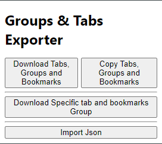
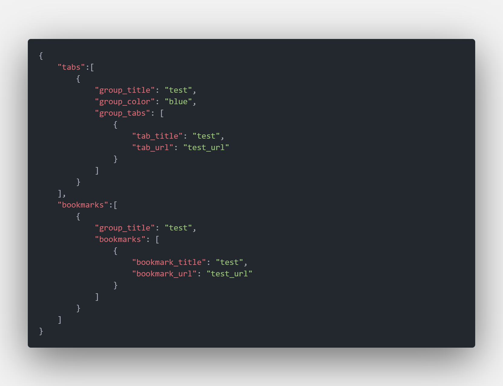
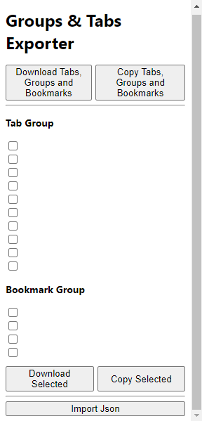
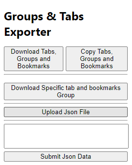

# browser_tab_bookmark_exporter

this project helps you download all the open tabs in grouped format if there are any
or even if they aren't in a json file

## installation

after cloning go into your browser or downloading the zip file (unzip it)  -> settings -> extensions -> turn on developer option if it's not -> load unapackaged -> project directory,  you can pin it in the browser

## usage

when installed you have to click on the extension and you will be presented with this

if you click in the first option you will get to download all grouped and ungrouped tabs and bookmarks in json format. just beside the first option you will get the option to copy the data 
exact data that was downloaded in the first option.

if you want to download any specific grouped tabs and bookmarks you select one or more group and click any button

if you want to import json data, click on import json data button and you will be presented with this.

you can either upload the entire json file you downloaded previously or paste and submit the json data.

## if you have anymore ideas or have made any better changes or added new features please submit a pull request so that this project can be improved